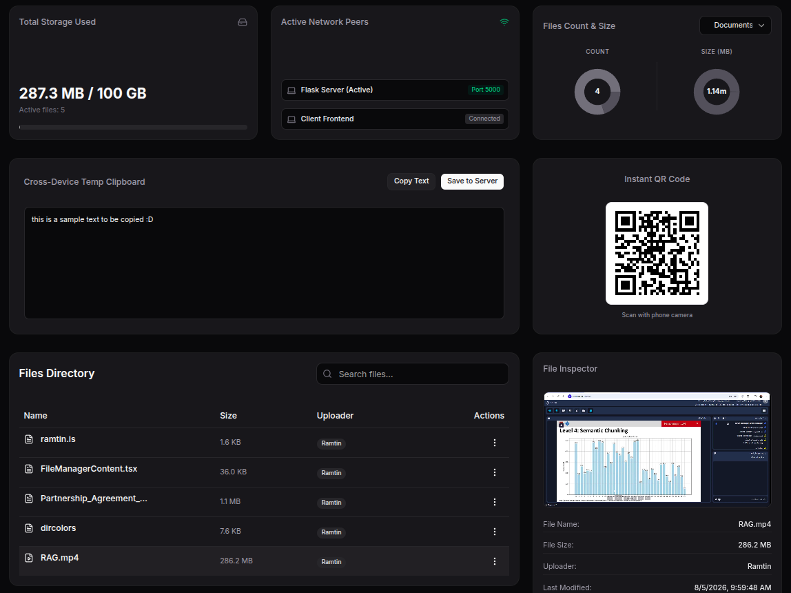
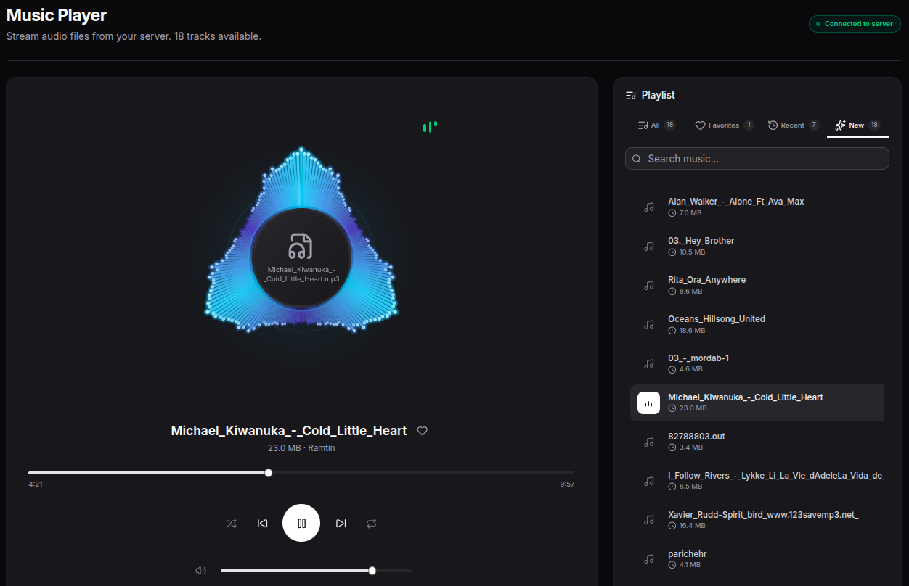

# RKHS - Home Server
<p align="center">
  
  
</p>

A lightweight full-stack local network file management system. Run it on an Ubuntu server and manage files from any laptop, phone, or tablet connected to the same Wi-Fi or Ethernet network.

## Quick Start

### 1. Start the Backend

```bash
cd Backend
python3 app.py
```

The backend runs on `http://0.0.0.0:5000`.

### 2. Start the Frontend

```bash
cd Frontend
npm install
npm run dev -- -H 0.0.0.0 -p 3000
```

The frontend runs on `http://0.0.0.0:3000`.

### 3. Access from Other Devices

Find your server IP:

```bash
ip a
```

Then open the frontend in a browser from any device on the same network:

```
http://<SERVER_IP>:3000
```

## Demo
https://github.com/user-attachments/assets/62401ad1-0de1-4a1b-9dd7-237d0a436469

## Project Structure

```
.
├── Backend/   # Python Flask API + local filesystem storage
└── Frontend/  # Next.js web interface
```

## Features

- Local network access from any device
- Upload, download, delete, and browse files
- Multi-file upload
- Folder support: create, rename, delete, and navigate directories
- Optional password protection for folders
- Search and filter files and folders
- PDF and image previews
- Live storage analytics dashboard
- Shared text scratchpad

## Notes

- This project is intended for **trusted local networks**.
- For public internet deployment, add authentication, HTTPS, firewall rules, and a reverse proxy.

## License

MIT License — Copyright (c) 2026 Ramtin Kosari.
